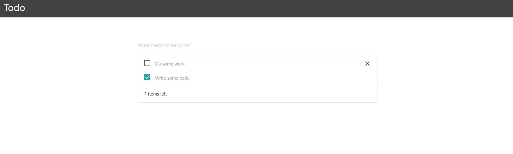

# Simple Todo - Angular

## The problem
Build a Todo application that can be used for a simple todo list in a local web browser. The bare minimum application should have a header with the application name, an input box to type the description of a new todo and a list of todos under it. The application does not need any back-end or database and if the website is refreshed the Todo list should refresh.

### Example (*style not important*)  

## Tech stack
* Angular using Typescript and not plain javascript
* Npm as a package manager (default Angular setup)
* Git as a repository

## Functional requirements
* Input field
  * The input field should contain a tooltip or placeholder containing the text `What needs to be done?`.
  * The input field to enter a todo description should be focussed by default when opening the browser.
  * If the input field contains text and the `enter` key is pressed, a new todo should be created and the input field cleared.
* Todo items
  * There should be one todo called `Do some work` when the application opens.
  * Each todo item in the list should have its own checkbox that starts off deselected, and can be selected.
  * Each todo item should contain a delete cross (or button).
  * When the delete cross or button is pressed, the todo item should be removed from the list.
* X items left to do
  * Under the todo list there should be text showing how many todo items should still be completed.
  * If there are 2 todo items and one has a selected checkbox, there is 1 todo item left.

## Technical requirements
* The application source code must be versioned using a public git repository on either Github, GitLab or Bitbucket.
* The application repository should contain a `readme.md` file containing the below.
  * A description of the application as you understand it.
  * How to build and run the code.
  * Any design choices or dependencies you chose to use.

## Tips
* Use small and focussed commits in your git repo. After each self-contained change ensure you commit the change.
* Consider using semantic commits to help categorise your changes.
* Remove any compiler or runtime warnings.
* Remove unneeded comments.
* Apply a code style format.

